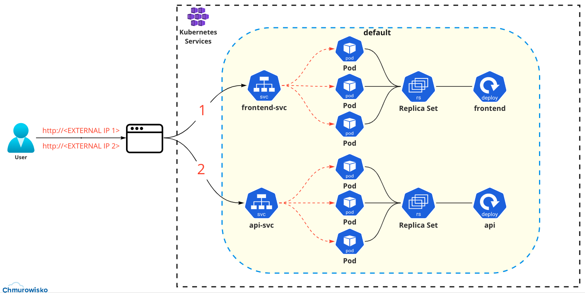

<br><br>
<br><br>
<br><br>

# Labels

## LAB Overview

In this lab, you will learn how labels work and why using them is important in Kubernetes.

**Case Study**: Help your colleagues on another team who are having trouble running their application. They ask you for help in finding and fixing the error in their implementation. They send you the [YAML file (app.yaml)](./files/app.yaml) that they created and visualization of how the expect application to work. 

**Task**: Check the operation of the application implemented by another team and find the error. Correct the YAML file so that the application works as shown in the visualization.


## Application visualization



## Task 1: Creating application using YAML file that you received

1. Create Kubernetes objects from [file](./files/app.yaml):
    
    ```bash
    kubectl create -f app.yaml
    ```

2. Check whether you have successfully deployed 2 deployments (frontend and api) and 2 services (frontend-svc and api-svc):

    ```bash
    kubectl get all --all
    ```

## Task 2: Find a mistake
1. Using any browser of your choice, navigate to **EXTERNAL-IP of frontend-svc** address. The output should display information about name of your deployment - **frontend**. 

    Also in the terminal, you can check the output by type:
    ```bash
    curl <EXTERNAL-IP of your service>
    ```
1. Repeat previous step using **EXTERNAL-IP of api-svc**. The output should display information about name of your deployment - **api**.

1. The Output of requesting **api service** is not expected. Analyze the output of these two commands and try to find the problem:
    
    ```bash
    kubectl describe svc frontend-svc
    ```

    ```bash
    kubectl describe svc api-svc
    ```
    
    Check and compare endpoints of services with internal IP of Pods. 
    Get internal IP of Pods you created:

    ```bash
    kubectl get pods -o wide
    ```

    You should realize that both services have the same endpoints and send requests to the pods from frontend deployment. 

1. Open a [file](./files/app.yaml) and analyze a code, especially **selector** and **labels** section.

1. The mistake is in **selector** section of **api-svc** because labels **app.kubernetes.io/component: frontend** should be: **app.kubernetes.io/component: api**. Edit this selector section of api-svc:

    ```bash
    kubectl edit svc api-svc
    ```

1. Using any browser of your choice, navigate to **EXTERNAL-IP of frontend-svc** address and check if the output is - **frontend**. 
1. Also navigate to **EXTERNAL-IP of api-svc** address and check if the output is - **api**. Application should work as shown in the visualization that you got from colleagues.

## Task 3: Delete everything you created in this lab
1. Delete all you created by typing:
    ```bash
    kubectl delete -f .
    ```
## END LAB

<br><br>

<center><p>&copy; 2023 Chmurowisko Sp. z o.o.<p></center>
